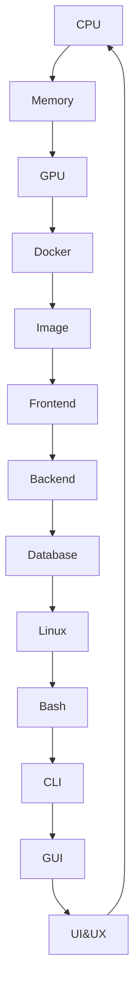
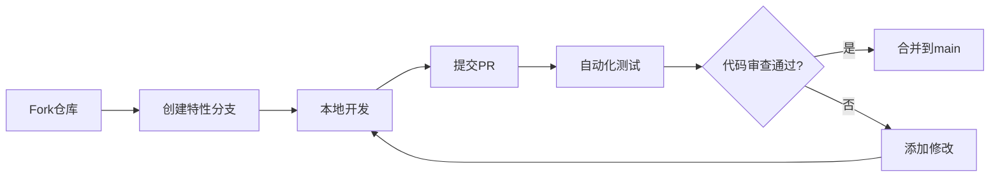
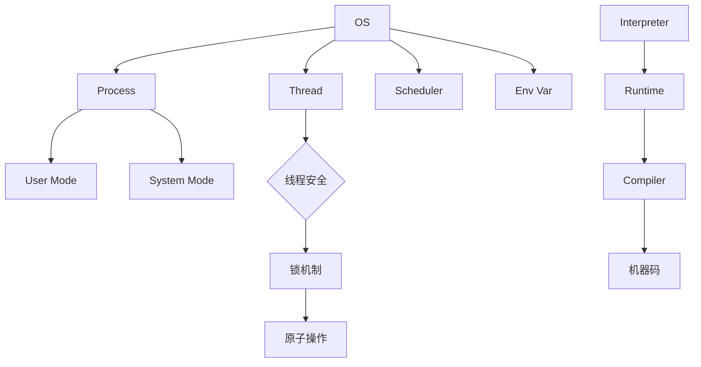
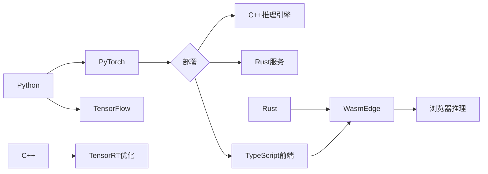
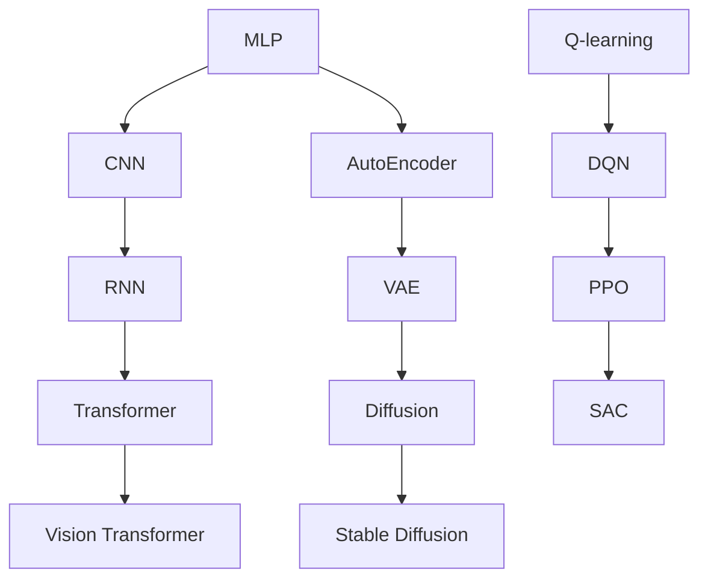

# 基础设施与基础概念自学手册

## 1. CPU（中央处理器）

### 零基础解释

CPU是物理实验室的**核心控制中枢**，就像粒子加速器的中央控制系统，负责协调探测器数据采集、环境参数监测和实验流程控制。CPU的每个核心相当于一个独立的实验控制单元，能同时处理多项任务。

### 物理系学生常见应用场景

1. **粒子轨迹重建**：同时处理多个探测器信号
2. **数据预处理**：特征工程提取粒子能量/动量
3. **模拟计算**：运行GEANT4仿真程序

### VSCode操作指引

1. 打开终端（Terminal > New Terminal）
2. 输入`lscpu`查看核心信息（Linux）
3. 使用`top`观察资源占用（实时监控实验进程）
4. 安装"Process Explorer"插件可视化进程树

### 基本配置

```bash
# 运行环境：Windows 11 + VSCode 1.88.0 + Git插件(v1.0.0)
# 查看CPU硬件信息（Linux）
lscpu  # list cpu，列出CPU详细规格

# Windows查看命令
wmic cpu get name,NumberOfCores,MaxClockSpeed  # 获取CPU型号/核心数/频率
```

### 算法应用（物理实验场景）

```bash
# 多进程处理实验数据
python -c "from multiprocessing import Pool; Pool(4).map(process_data, files)"  # 使用4进程并行处理
```

### 硬件安装教程

**Windows平台CUDA安装**：

1. 访问[NVIDIA官网](https://developer.nvidia.com/cuda-downloads)
2. 选择"Windows" → "x86_64" → "Microsoft" → "10" → "12.1"
3. 双击下载的exe文件 → 选择"自定义安装" → 勾选CUDA工具包
4. 在VSCode终端运行`nvidia-smi`验证安装
5. 安装NVIDIA驱动535+（物理实验探测器专用驱动）
6. 在VSCode设置Docker插件连接本地CUDA环境

## 2. Memory（内存）

### 零基础解释

内存是电脑的"工作台"，临时存放正在处理的数据。就像物理实验室的**数据缓冲区**，用于暂存探测器采集的原始信号。

### 物理场景类比解释

在粒子物理实验中：

- 内存相当于探测器的**数据缓冲区**：
    - 存储瞬时的粒子轨迹数据（类似处理实时信号）
    - 大容量内存支持多探测器同时采集（类比多线程处理）
    - 数据预处理阶段的特征存储（如粒子能量分布直方图）

### 基本配置

```python
# Python内存优化示例
import numpy as np
# 使用float32代替float64节省内存
arr = np.zeros(1000, dtype=np.float32)
```

### 算法应用

- 大批量训练时的内存管理
- 图像处理的缓冲区分配
- 推荐系统的实时特征存储

## 3. GPU（图形处理器）

### 零基础解释

GPU是专为并行计算设计的处理器，像**粒子轨迹重建的并行处理阵列**，特别适合同时处理数千个粒子信号。

### 物理场景类比解释

在粒子物理实验中：

- GPU相当于**探测器信号并行处理系统**：
    - 同时处理数千个粒子探测器通道（类似CUDA核心处理并行计算）
    - 加速粒子轨迹重建算法（如Kalman滤波并行化）
    - 大规模蒙特卡洛模拟加速（如GEANT4仿真）

### 基本配置

```bash
# 验证CUDA安装（物理场景）
nvidia-smi # 查看GPU状态（类似监测探测器工作状态）
nvcc --version # 检查CUDA编译器版本
```

### 基本配置

```bash
# 验证CUDA安装
nvidia-smi
nvcc --version
```

### 算法应用

- 深度学习模型训练（CNN/RNN加速）
- 张量运算加速（比CPU快10-100倍）
- 实时推理服务部署

## 4. Docker/Apptainer

### 零基础解释

Docker/Apptainer是软件打包工具，像**实验室的标准化实验箱**，能将实验所需的所有设备和材料打包，确保在不同实验室复现实验环境。

### 物理场景类比解释

在粒子物理实验中：

- Docker相当于**标准化实验运输箱**：
    - 打包探测器数据处理软件栈（类比集装箱装载实验设备）
    - 确保CERN与本地实验室环境一致（跨平台复现实验条件）
    - 支持多版本实验软件共存（如GEANT4仿真不同版本并行）

### 基本配置

```dockerfile
# 运行环境：Windows 11 + Docker 24.0 + VSCode Docker插件(v1.18.0)
# 粒子模拟Dockerfile示例
FROM nvidia/cuda:12.1-base
# 安装实验软件栈
RUN apt-get update && apt-get install -y python3-pip geant4
# 挂载实验数据目录
VOLUME /experiment_data
# 设置工作路径
WORKDIR /app
# 启动模拟脚本
CMD ["bash", "run_simulation.sh"]
```

### 基本配置

```dockerfile
# 示例Dockerfile
FROM nvidia/cuda:12.1-base
RUN apt-get update && apt-get install -y python3-pip
COPY . /app
WORKDIR /app
CMD ["python", "app.py"]
```

### 算法应用

- 模型部署的标准化环境
- 训练环境版本隔离
- 分布式训练的容器化编排（K8s）

## 5. Image（镜像）

### 零基础解释

镜像像"系统模板"，包含运行应用所需的所有文件和配置，是容器的静态版本。

### 基本操作

```bash
# 构建镜像
docker build -t ml-model:v1 .

# 推送镜像
docker push registry.example.com/ml-model:v1
```

### 算法应用

- 版本控制（v1.0.0-训练环境，v1.0.1-推理环境）
- 依赖管理（特定版本的PyTorch/CUDA组合）
- CI/CD流水线中的标准化构建

## 6. Authorization & Authentication

### 零基础解释

认证（AuthN）验证身份（你是谁），授权（AuthZ）决定权限（你能做什么）。

### 基本实现

```python
# JWT认证示例
import jwt
token = jwt.encode({'user_id': 123}, 'SECRET_KEY', algorithm='HS256')
```

### 算法应用

- MLOps平台的访问控制
- API服务的调用权限管理
- 数据隐私保护（GDPR合规）

## 7. Frontend（前端）

### 零基础解释

前端是用户直接交互的部分，像商店的橱窗和收银台，处理用户输入和展示结果。

### 技术栈示例

```javascript
// React组件示例
function PredictionBox({ model }) {
  const [input, setInput] = useState('');
  return (
    <div>
      <input onChange={e => setInput(e.target.value)} />
      <button onClick={() => model.predict(input)}>预测</button>
    </div>
  );
}
```

### 算法应用

- 可视化模型预测结果
- 实时推理的前端集成
- 用户反馈数据收集

## 8. Backend（后端）

### 零基础解释

后端是系统的核心逻辑，像商店的仓库和管理系统，处理数据存储和业务逻辑。

### API示例

```python
# FastAPI示例
from fastapi import FastAPI
app = FastAPI()

@app.post("/predict")
def predict(item: Item):
    result = model.predict(item.data)
    return {"result": result}
```

### 算法应用

- 模型服务封装（REST/gRPC）
- 异步任务处理（Celery）
- 数据管道构建

## 9. Linux

### 零基础解释

Linux是一个开源操作系统，像可定制的瑞士军刀，是大多数服务器的底层系统。

### 常用命令

```bash
# 监控GPU使用
watch -n 1 nvidia-smi

# 查找大文件
find / -type f -size +1G
```

### 算法应用

- 服务器环境配置
- 自动化脚本编写
- 资源监控与调优

## 10. Bash

### 零基础解释

Bash是Linux的命令行解释器，像指挥家指挥各种工具协同工作。

### 脚本示例

```bash
#!/bin/bash
# 批量预处理脚本
for file in *.csv; do
  python preprocess.py $file > processed/${file%.csv}.pt
done
```

### 算法应用

- 数据处理流水线
- 批量任务调度
- 环境自动化配置

## 11. CLI（命令行界面）

### 零基础解释

CLI是通过文字命令与计算机交互的方式，像直接与电脑对话。

### 设计原则

```python
# Click CLI示例
import click

@click.command()
@click.option('--count', default=1, help='Number of greetings.')
def hello(count):
    for _ in range(count):
        click.echo('Hello!')
```

### 算法应用

- 模型训练参数配置
- 实验复现命令设计
- 自动化测试脚本

## 12. GUI（图形用户界面）

### 零基础解释

GUI通过图形元素与用户交互，像自动售货机的触摸屏界面。

### 开发示例

```python
# Tkinter示例
import tkinter as tk
window = tk.Tk()
window.title("Model Inspector")

label = tk.Label(window, text="模型准确率：")
label.pack()

accuracy = tk.StringVar()
accuracy.set("98.2%")
tk.Label(window, textvariable=accuracy).pack()

window.mainloop()
```

### 算法应用

- 模型可视化工具
- 数据标注界面
- 实验监控仪表盘

## 13. UI&UX（用户界面与体验）

### 零基础解释

UI是界面设计，UX是使用体验，共同决定产品是否易用好用。

### 设计原则

1. 尼尔森十大原则（状态可见性、系统与现实一致性）
2. 数据可视化黄金比例（数据墨水比）
3. 响应时间容忍度（100ms/1s/10s法则）

### 算法应用

- 可解释AI的可视化设计
- 数据标注工具优化
- 实验结果展示优化

## 14. Database（数据库）

### 零基础解释

数据库是结构化存储数据的仓库，像图书馆的管理系统。

### 基本操作

```sql
-- 创建训练数据表
CREATE TABLE training_data (
    id SERIAL PRIMARY KEY,
    features JSONB,
    label FLOAT,
    created_at TIMESTAMP DEFAULT NOW()
);
```

### 算法应用

- 训练数据存储
- 实验结果记录
- 用户行为分析

## 附录：技术关联图谱



# 版本控制与开发工具自学手册

## 1. Git

### 零基础解释

Git是代码的"实验数据版本控制系统"，能记录每次数据采集和处理过程。就像物理实验的**数据记录本**，可追溯每个实验版本。

### 物理场景类比解释

在粒子实验中：

- Git相当于**实验数据版本管理**：
    - 记录不同探测器配置下的数据采集（如commit不同实验参数）
    - 对比不同数据处理算法效果（git diff查看差异）
    - 恢复异常实验数据（git revert回溯）

### 基本配置

```bash
# 初始化仓库（物理实验数据记录本）
git init
# 查看状态（当前实验数据状态）
git status

# Windows查看命令（物理实验数据路径）
cd C:/Experiment/Data_2023
```

### 基本配置

```bash
# 初始化仓库
git init

# 查看状态
git status

# 配置用户信息
git config --global user.name "YourName"
git config --global user.email "email@example.com"
```

### 算法应用

- 追踪数据集变更（记录特征工程版本）
- 模型迭代管理（对比不同训练版本）
- 实验复现（精确还原历史代码状态）

## 2. GitHub

### 零基础解释

GitHub是代码的"云存储保险箱+社交平台"，既能安全保存代码，又能与全球开发者协作。

### 核心功能

```bash
# 克隆仓库
git clone https://github.com/example/repo.git

# 添加远程仓库
git remote add origin https://github.com/yourname/repo.git
```

### 算法应用

- 开源模型共享（如Hugging Face模型库）
- 协作开发（多人参与的算法优化）
- 文档托管（算法白皮书的Markdown展示）

## 3. Pull Request (PR)

### 零基础解释

PR是代码的"同行评审申请"，当你完成代码修改后，通过PR请求他人审查并合并到主分支。

### 审查流程

1. 创建PR时填写：
    - 修改目的说明
    - 关联Issue编号
    - 变更范围描述
2. 自动化检查：
    - CI/CD流水线验证
    - 代码风格检查
3. 人工评审：
    - 3人同行评审机制
    - 可请求特定专家审查

### 算法应用

- 模型改进提案审查
- 数据集更新评审流程
- 算法漏洞修复验证

## 4. 基础Git命令

### 核心工作流

```bash
# 1. 添加修改
git add src/model.py

# 2. 提交变更
git commit -m "优化CNN模型结构"

# 3. 推送远程
git push origin feature/attention

# 4. 拉取更新
git pull --rebase origin main
```

### 高级技巧

```bash
# 暂存未完成修改
git stash

# 查看变更差异
git diff HEAD~2 HEAD

# 回滚特定提交
git revert abc1234
```

### 算法场景

- 多分支实验对比（A/B测试不同算法）
- 数据预处理流水线版本控制
- 超参数调优记录追踪

## 5. VSCode Git GUI

### 零基础操作指南

1. **变更查看器**
    - 左侧活动栏Git图标
    - 分组查看修改文件
    - 内联代码差异对比

2. **可视化提交**
    - 勾选文件添加暂存
    - 输入提交信息
    - 点击"√"完成提交

3. **分支管理**
    - 底部状态栏切换分支
    - 右键创建新分支
    - 拖拽实现分支合并

### 高效技巧

- **时间线视图**：查看提交历史与关联PR
- **CodeLens集成**：直接在代码编辑器查看变更作者
- **冲突解决器**：图形化合并冲突文件

### 算法开发优化

- 实时追踪数据处理脚本变更
- 可视化对比模型性能差异
- 快速回溯历史实验配置

## 附录：协作开发工作流



## 工具链整合建议

```json
{
  "机器学习项目配置": {
    "gitignore": ["*.h5", "*.pt", "__pycache__"],
    "CI配置": {
      "pre-commit": "black . && isort .",
      "on-pr": "pytest && mypy ."
    },
    "分支策略": {
      "main": "生产就绪模型",
      "dev": "稳定验证版本",
      "feature/*": "算法实验分支"
    }
  }
}

```

# 操作系统与程序基础自学手册

## 1. Process（进程）

### 零基础解释

进程是运行中的程序实例，像**物理实验室的独立实验组**，每个进程都有独立的实验器材和数据空间。

### 物理场景类比解释

在粒子物理实验中：

- 进程相当于**独立的探测器采集系统**：
    - 每个探测器独立运行（进程隔离）
    - 拥有独立的原始数据存储（私有内存空间）
    - 实验流程互不干扰（进程间隔离）

### VSCode操作指引

1. 打开终端（Terminal > New Terminal）
2. 输入`ps aux | grep python`查看进程
3. 使用`top`观察资源占用（Linux）
4. 在"Process Explorer"插件可视化进程树

### 基本操作

```bash
# 查看进程（Linux）
ps aux | grep python
top

# Windows查看
tasklist | findstr :8000
```

### 算法应用

- 分布式训练：多进程并行处理数据
- 资源隔离：限制单个模型训练的内存使用
- 任务监控：跟踪训练进程的CPU/GPU占用

## 2. Thread（线程）

### 零基础解释

线程是进程内的执行单元，像生产线上的工人，共享同一工作空间但能并行工作。

### 核心操作

```python
# Python多线程示例
import threading

def train_model():
    # 模拟训练过程
    pass

threads = [threading.Thread(target=train_model) for _ in range(4)]
for t in threads: t.start()
```

### 算法应用

- 数据预处理：并行处理图像数据
- 实时推理：多线程处理并发请求
- GIL优化：结合C扩展突破Python全局锁限制

## 3. Env Var（环境变量）

### 零基础解释

环境变量是系统级的配置参数，像工厂的通用操作规范，影响程序运行时的行为。

### 管理方法

```bash
# 设置环境变量
export CUDA_VISIBLE_DEVICES=0,1  # Linux
setx CUDA_VISIBLE_DEVICES "0,1"  # Windows

# 查看变量
printenv | grep PATH
```

### 算法应用

- 多环境配置（DEV/TEST/PROD）
- 硬件加速开关（MKL_NUM_THREADS）
- 代理设置（HTTPS_PROXY）

## 4. OS（操作系统）

### 零基础解释

操作系统是管理硬件和软件的"工厂管理系统"，协调所有资源的分配和使用。

### 核心管理

```powershell
# 查看系统信息（Windows）
systeminfo | findstr /B /C:"OS Name" /C:"OS Version"

# Linux系统监控
sar -u 1 5  # CPU使用统计
```

### 算法应用

- 资源调度策略（CPU亲和性设置）
- 文件系统优化（SSD/HDD调度算法）
- 内核参数调优（网络参数/TCP优化）

## 5. Scheduler（调度器）

### 零基础解释

调度器是系统的"生产调度员"，决定哪个进程/线程何时使用CPU资源。

### 调度策略

```bash
# 实时优先级设置（Linux）
chrt -p 99 <pid>  # FIFO调度

# 查看调度器信息
cat /proc/schedstat
```

### 算法应用

- 实时推理任务优先级保障
- 分布式训练的通信调度优化
- GPU任务的抢占式调度

## 6. System vs. User（系统与用户）

### 零基础解释

系统权限像工厂管理员，用户权限像普通工人，区分资源访问级别。

### 权限管理

```bash
# Linux权限检查
ls -l /dev/nvidia*  # GPU设备权限
sudo -l  # 用户sudo权限

# Windows服务管理
sc qc "NVIDIA Display Container LS"
```

### 算法应用

- 模型服务部署权限配置
- 安全沙箱环境搭建
- 特权操作审计（sudo日志）

## 7. Compiler（编译器）

### 零基础解释

编译器是代码的"翻译官"，将高级语言翻译成机器能理解的指令。

### 编译优化

```bash
# C++编译优化示例
g++ -O3 -march=native -mfma model.cpp  # 启用CPU特性

# 查看编译器支持
gcc -march=native -Q --help=target
```

### 算法应用

- 模型推理引擎优化（TensorRT编译选项）
- 自动向量化（SIMD指令利用）
- 异构计算编译（OpenCL/CUDA）

## 8. Interpreter（解释器）

### 零基础解释

解释器是代码的"实时翻译器"，逐行执行指令而无需提前编译。

### 环境管理

```bash
# Python虚拟环境
python -m venv env
source env/bin/activate  # Linux
env\Scripts\activate  # Windows

# 查看解释器路径
which python
```

### 算法应用

- 快速原型开发（Jupyter Notebook）
- 动态代码加载（插件式算法模块）
- 字节码优化（PyPy加速）

## 附录：技术关联图谱



## 性能调优参考表

| 技术维度 | 编译器优化 | 解释器优化      | 调度策略  | 环境配置              |
| -------- | ---------- | --------------- | --------- | --------------------- |
| 深度学习 | CUDA编译器 | PyTorch JIT     | GPU优先级 | CUDA_VISIBLE_DEVICES  |
| 数据处理 | SIMD向量化 | Pandas扩展      | 多线程    | OMP_NUM_THREADS       |
| 推理服务 | AOT编译    | 异步IO          | 实时调度  | TF_ENABLE_ONEDNN_OPTS |
| 资源监控 | -          | Memory Profiler | CPU绑核   | NCCL_DEBUG            |

# 编程语言自学手册

## 1. Python

### 零基础解释

Python是**物理实验的快速数据记录仪**，简洁的语法适合快速记录和分析实验数据，就像用Python快速分析粒子轨迹、绘制光谱图。

### 物理场景类比解释

在粒子物理实验中：

- Python相当于**实验数据快速分析仪**：
    - 使用Pandas清洗探测器信号（类似数据清洗）
    - NumPy处理粒子轨迹张量（矢量运算）
    - Matplotlib绘制能谱图（数据可视化）

### VSCode操作指引

1. 安装**Python插件(v2024.0.0)**
2. 创建虚拟环境：
    - 终端输入`python -m venv env`
    - 激活环境：Linux用`source env/bin/activate`，Windows用`env\Scripts\activate`
3. 在编辑器右下角选择Python解释器
4. 使用Jupyter Notebook交互式编程（适合实验数据分析）

### 基本配置

```bash
# 创建虚拟环境
python -m venv env
source env/bin/activate  # Linux/Mac
env\Scripts\activate  # Windows

# 安装物理分析库
pip install numpy pandas matplotlib scikit-learn torch
```

### 算法应用

- **数据处理**：Pandas清洗粒子轨迹数据
- **模型构建**：PyTorch/TensorFlow搭建神经网络
- **训练优化**：使用Joblib保存模型快照

### 基本配置

```bash
# 创建虚拟环境
python -m venv env
source env/bin/activate  # Linux/Mac
env\Scripts\activate  # Windows

# 安装常用库
pip install numpy pandas matplotlib scikit-learn torch
```

### 算法应用

- **数据处理**：Pandas清洗数据，NumPy处理张量
- **模型构建**：PyTorch/TensorFlow搭建神经网络
- **训练优化**：使用Joblib保存模型快照
- **部署服务**：FastAPI封装REST接口

## 2. C/C++

### 零基础解释

C/C++是"精密机械工程师"，提供底层硬件控制能力，C是操作系统基石，C++在此基础上增加面向对象特性。

### 基本配置

```bash
# Linux编译示例
g++ -O3 -march=native -mfma model.cpp -o model \
    -I/usr/local/include/eigen3 \
    -L/usr/local/lib -ltensorflow

# Windows编译（MSVC）
cl /O2 /arch:AVX2 /EHsc /I"C:\tensorflow\include" \
    model.cpp /link /LIBPATH:"C:\tensorflow\lib" tensorflow.lib
```

### 算法应用

- **高性能计算**：Eigen实现矩阵运算加速
- **框架开发**：TensorFlow/PyTorch底层实现
- **嵌入式部署**：在边缘设备运行轻量模型
- **混合编程**：Python C扩展提升性能瓶颈

## 3. Rust

### 零基础解释

Rust是"自带安全带的赛车"，在保证内存安全的同时提供接近C的性能，适合构建可靠且高效的系统。

### 基本配置

```bash
# 安装工具链
curl --proto '=https' --tlsv1.2 -sSf https://sh.rustup.rs | sh
rustup install nightly

# 创建项目
cargo new ml_kernel --lib
cd ml_kernel
```

### 算法应用

- **系统编程**：构建分布式训练框架
- **WebAssembly**：编译为WASM在浏览器运行
- **区块链应用**：Solana智能合约开发
- **安全计算**：TEE可信执行环境编程

## 4. TypeScript

### 零基础解释

TypeScript是"带说明书的JavaScript"，在JavaScript基础上增加类型系统，让大型前端应用更易维护。

### 基本配置

```bash
# 初始化项目
npm create vite@latest my-app --template react-ts
cd my-app
npm install

# 添加机器学习依赖
npm install @tensorflow/tfjs @types/tensorflow__tfjs
```

### 算法应用

- **前端推理**：TensorFlow.js在浏览器运行模型
- **可视化**：D3.js绘制训练过程图表
- **后端服务**：Node.js构建API网关
- **跨平台**：React Native开发移动端应用

## 附录：语言特性对比表

| 特性维度     | Python       | C++        | Rust     | TypeScript |
| ------------ | ------------ | ---------- | -------- | ---------- |
| 性能等级     | ★★☆☆☆        | ★★★★★      | ★★★★★    | ★★☆☆☆      |
| 学习曲线     | ★☆☆☆☆        | ★★★★☆      | ★★★★☆    | ★★★☆☆      |
| 内存安全     | ★★☆☆☆        | ★☆☆☆☆      | ★★★★★    | ★★★☆☆      |
| 并发支持     | ★★☆☆☆        | ★★★☆☆      | ★★★★★    | ★★★★☆      |
| 生态成熟度   | ★★★★★        | ★★★★★      | ★★★☆☆    | ★★★★★      |
| 典型应用场景 | 快速原型开发 | 高性能计算 | 系统编程 | Web开发    |

## 机器学习工具链整合



## 多语言协作示例

```python
# Python调用C++扩展
import torch
import ctypes

# 加载C++编译的DLL
lib = ctypes.CDLL('./fast_kernel.dll')

# 定义Tensor操作
def custom_op(input_tensor):
    # 调用C++实现的快速卷积
    return torch.ops.load_library("fast_convolution", input_tensor)

```

# 机器学习核心自学手册

## 1. Neural Network（神经网络）

### 零基础解释

神经网络是**粒子轨迹拟合模型**，由多层计算单元组成，能通过实验数据学习粒子运动规律。就像物理实验中用多层探测器记录粒子路径，通过反向传播调整探测器参数。

### 物理场景类比解释

在粒子物理实验中：

- 神经网络相当于**多层探测器数据拟合**：
    - 输入层：探测器原始信号（类似粒子入射）
    - 隐藏层：粒子与物质相互作用（非线性变换）
    - 输出层：粒子种类识别（如缪子/强子）

### VSCode操作指引

1. 安装Python插件(v2024.0.0)
2. 创建Jupyter Notebook交互环境
3. 使用TensorBoard可视化训练过程
4. 在"Python: Select Interpreter"中选择GPU环境

### 基本配置

```bash
# 安装PyTorch
pip install torch torchvision torchaudio
```

### 核心实现

```python
# PyTorch粒子轨迹拟合示例
import torch.nn as nn

class ParticleNN(nn.Module):
    def __init__(self):
        super().__init__()
        self.layers = nn.Sequential(
            nn.Linear(5, 10),  # 输入：5个探测器信号
            nn.ReLU(),          # 非线性变换（类似粒子非弹性散射）
            nn.Linear(10, 3)   # 输出：3维粒子特征（能量/动量/电荷）
        )
    
    def forward(self, x):
        return self.layers(x)
```

### 算法应用

- **粒子识别**：拟合探测器信号
- **轨迹预测**：LSTM处理时间序列数据
- **异常检测**：AutoEncoder识别异常粒子信号

### 物理系学生场景

```python
# 使用物理实验数据
from torch.utils.data import DataLoader
from particle_dataset import ParticleDataset

# 创建数据加载器
train_loader = DataLoader(
    ParticleDataset('data/accelerator_runs'),  # 实验室数据集
    batch_size=32, 
    shuffle=True
)

# 训练循环
for batch in train_loader:
    predictions = model(batch['signals'])  # 拟合探测器信号
    loss = criterion(predictions, batch['truth'])  # 对比预测与真实轨迹
    loss.backward()  # 反向传播调整探测器参数
```

### 基本配置

```python
# PyTorch神经网络示例
import torch.nn as nn

class SimpleNet(nn.Module):
    def __init__(self):
        super().__init__()
        self.layers = nn.Sequential(
            nn.Linear(784, 128),
            nn.ReLU(),
            nn.Linear(128, 10)
        )
    
    def forward(self, x):
        return self.layers(x)
```

### 算法应用

- 图像分类：FashionMNIST数据集训练
- 时间序列预测：LSTM处理股价预测
- 异常检测：AutoEncoder识别异常交易

## 2. MLP（多层感知机）

### 零基础解释

MLP是经典神经网络，像多层过滤网，通过隐藏层逐层提取特征，适合表格数据处理。

### 核心实现

```python
# 使用scikit-learn的MLP
from sklearn.neural_network import MLPClassifier

model = MLPClassifier(
    hidden_layer_sizes=(64, 32),
    activation='relu',
    solver='adam'
)
model.fit(X_train, y_train)
```

### 算法场景

- 金融风控：信用卡欺诈检测
- 医疗诊断：疾病预测模型
- 工业检测：设备故障预测

## 3. CNN（卷积神经网络）

### 零基础解释

CNN是图像识别专用网络，像扫描仪+特征提取器，能自动识别图像中的边缘、形状等特征。

### 核心架构

```python
# TensorFlow CNN示例
import tensorflow as tf

model = tf.keras.Sequential([
    tf.keras.layers.Conv2D(32, (3,3), activation='relu', input_shape=(28,28,1)),
    tf.keras.layers.MaxPooling2D((2,2)),
    tf.keras.layers.Flatten(),
    tf.keras.layers.Dense(10, activation='softmax')
])
```

### 应用场景

- 医学影像：肿瘤检测
- 自动驾驶：交通标志识别
- 工业质检：缺陷检测系统

## 4. Transformer

### 零基础解释

Transformer是序列处理革命者，像注意力雷达，能捕捉长距离依赖关系，彻底改变NLP领域。

### 架构实现

```python
# 使用HuggingFace Transformers
from transformers import BertModel, BertTokenizer

tokenizer = BertTokenizer.from_pretrained('bert-base-uncased')
model = BertModel.from_pretrained('bert-base-uncased')

inputs = tokenizer("Hello, my dog is cute", return_tensors="pt")
outputs = model(**inputs)
```

### 应用场景

- 机器翻译：多语言转换系统
- 药物发现：分子序列生成
- 语音识别：端到端ASR模型

## 5. Pre-train（预训练）

### 零基础解释

预训练是"知识迁移"，像先学习通用知识再专攻专业技能，通过大规模数据训练通用模型。

### 实践流程

```bash
# 使用HuggingFace Model Hub
from transformers import AutoModelForMaskedLM

# 加载预训练配置
model = AutoModelForMaskedLM.from_pretrained("bert-base-uncased")
```

### 应用场景

- 领域适配：继续预训练（Domain-continued Pretraining）
- 知识蒸馏：教师模型指导学生模型
- 多任务学习：统一表示空间

## 6. Mid-train（训练中阶段）

### 零基础解释

Mid-train是模型训练的关键期，像运动员的强化训练阶段，需要动态调整训练策略。


### 核心技术

```python
# 学习率调度器示例
from torch.optim.lr_scheduler import OneCycleLR

scheduler = OneCycleLR(
    optimizer, 
    max_lr=1e-3,
    total_steps=num_training_steps
)
```

### 优化策略

- 动态批处理：梯度累积
- 混合精度：AMP训练
- 早停机制：监控验证损失

## 7. SFT（监督式微调）

### 零基础解释

SFT是"专业技能训练"，像医生在通用知识基础上专攻手术技能，在预训练后针对具体任务微调。

### 实现流程

```python
# 使用PEFT进行LoRA微调
from peft import LoraConfig, get_peft_model

peft_config = LoraConfig(
    task_type="CAUSAL_LM",
    r=8,
    lora_alpha=16,
    target_modules=["q_proj", "v_proj"]
)
model = get_peft_model(model, peft_config)
```

### 应用场景

- 情感分析：电商评论分类
- 代码生成：特定编程语言适配
- 医疗问答：领域知识注入

## 8. RL（强化学习）

### 零基础解释

RL是"试错学习"，像训练宠物通过奖励机制学习动作，适用于决策类问题。

### 核心实现

```python
# Stable Baselines3 DQN示例
from stable_baselines3 import DQN
from gym import make

env = make('CartPole-v1')
model = DQN("MlpPolicy", env, verbose=1)
model.learn(total_timesteps=10000)
```

### 应用场景

- 游戏AI：Atari游戏突破
- 机器人控制：动作策略优化
- 推荐系统：动态内容推荐

## 9. Hack & Anti-hack（对抗攻击与防御）

### 零基础解释

对抗攻击是"误导AI"，像给图片添加肉眼不可见的噪声导致分类错误，防御则是增强模型鲁棒性。

### 攻击示例

```python
# FGSM攻击实现
import torchattacks

attack = torchattacks.FGSM(model, eps=0.007)
adv_images = attack(images, labels)
```

### 防御策略

```python
# 对抗训练示例
from torchattacks import PGD

attack = PGD(model, eps=0.01, alpha=0.01, steps=10)
for images, labels in train_loader:
    adv_images = attack(images, labels)
    outputs = model(adv_images)
    loss = criterion(outputs, labels)
    loss.backward()
```

### 应用场景

- 安全检测：对抗样本识别
- 模型加固：对抗训练
- 隐私保护：差分隐私注入

## 附录：技术演进图谱



## 模型选择决策表

| 任务类型 | 推荐模型 | 训练技巧   | 部署优化   |
| -------- | -------- | ---------- | ---------- |
| 图像分类 | ResNet50 | MixUp增强  | ONNX量化   |
| 文本生成 | GPT-2    | 梯度检查点 | TensorRT   |
| 语音识别 | Wav2Vec2 | 动态掩码   | 束搜索优化 |
| 推荐系统 | DeepFM   | 负采样     | 特征缓存   |
| 时序预测 | Informer | 扩展窗口   | 自回归解码 |

## 大模型训练优化策略

```yaml
distributed_training:
  strategy: "DeepSpeed"
  stages:
    - "Zero-1": optimizer states partitioning
    - "Zero-2": gradient partitioning
    - "Zero-3": model states partitioning
    - "ZeRO-Infinity": NVMe卸载
  activation_checkpointing: true
  compression:
    quantization:
      bits: 8
      method: "dynamic"
    sparsity:
      level: 0.5
      type: "structured"
```
